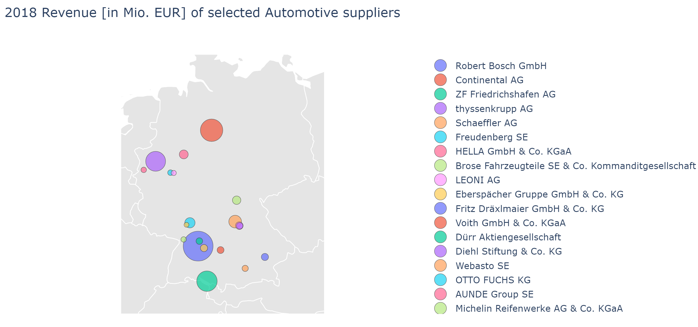

# Plotly_Vizualization
This is a repo for visualizing some lists with Plotly

Thanks to [Listenchampion](https://www.listenchampion.de) that they provided a small list to me for Visualization Purposes. This Repo will use a list of selected *automotive suppliers throughout Germany*. 

## Installation 

First of all you have to install all the necessary packages: 

``` python
pip3 install pandas, plotly, chart_studio, googlemaps
```
After you run all of them, it should be possible to run each cell in the jupyter notebook.

## Visualizations

### Germany Map
It is possible to get the location of the suppliers by their address and visualize it on the map of Germany. The bubble sizes represent their respective revenue in 2018 in mio EUR.





### Revenue Development Curve
Instead of the Geo Location of each of the suppliers, it is also possible to only visualize their development by revenue over the years (from 2015 until 2018): 

<div>
    <a href="https://plotly.com/~lenlehm/13/?share_key=rj8NtYqrozZzCjwlN6RVYq" target="_blank" title="revenue difference map" style="display: block; text-align: center;"></a>
    <script data-plotly="lenlehm:13" sharekey-plotly="rj8NtYqrozZzCjwlN6RVYq" src="https://plotly.com/embed.js" async></script>
</div>


